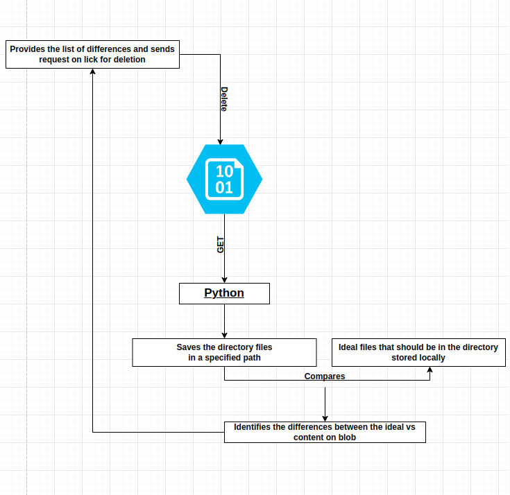

# Azure Blob Storage and Local Directory Comparison

## Overview

This Python script compares the files in an Azure Blob Storage container with those in a local directory. It identifies files that are missing in the local directory and files that are extra in the local directory but not in the Azure Blob Storage container.

## Prerequisites

- Python 3.x
- Azure Storage Blob SDK
- Python Dotenv for loading environment variables

## Setup

1. **Clone the Repository**

   ```bash
   git clone https://github.com/your-username/your-repo.git
   cd your-repo
2. **Installation of Required Packages**

   ```bash
   pip3 install -r requirements.txt

3. **Running**
   ```bash
   python3 app.py
   
4. **Proposed Plan: FLOW DIAGRAM**
   
   